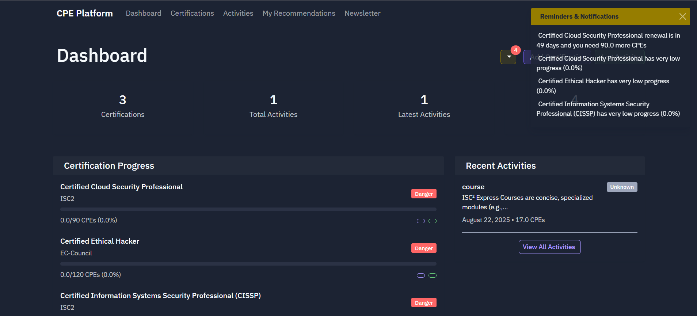
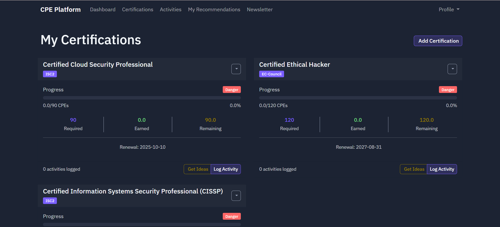
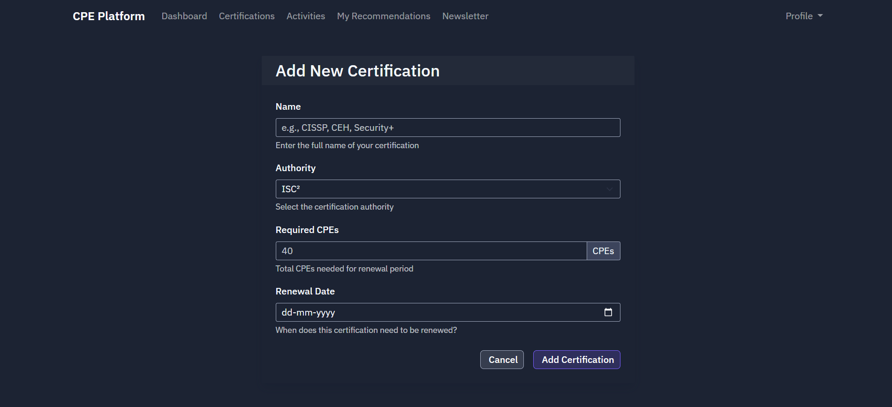
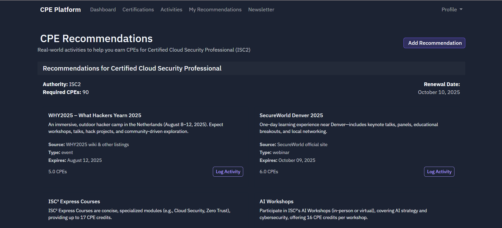
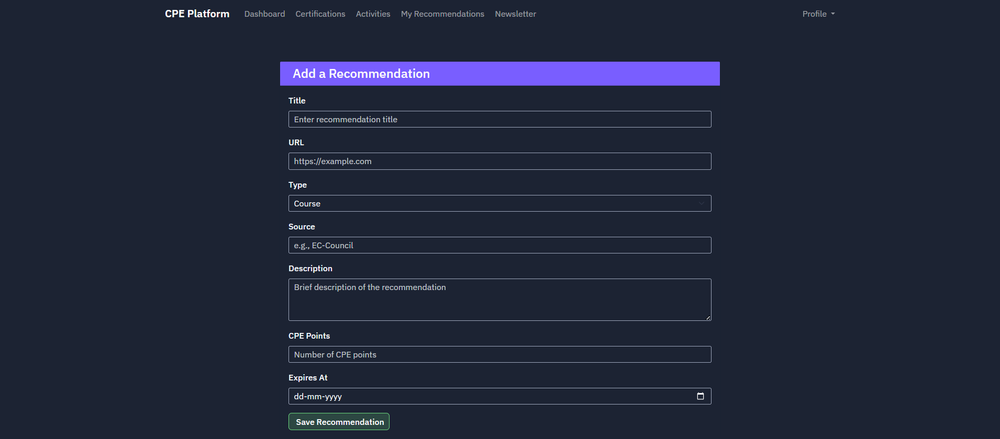
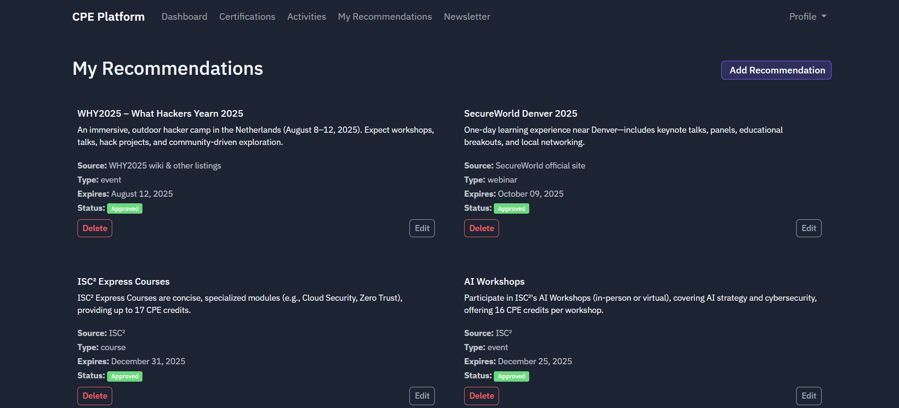
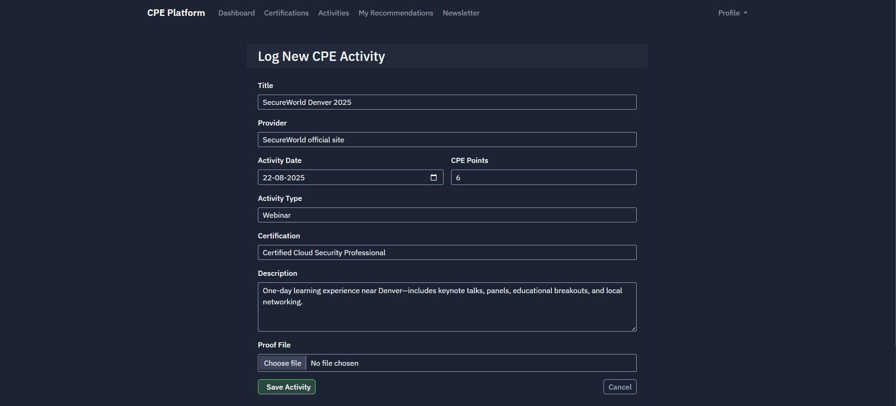
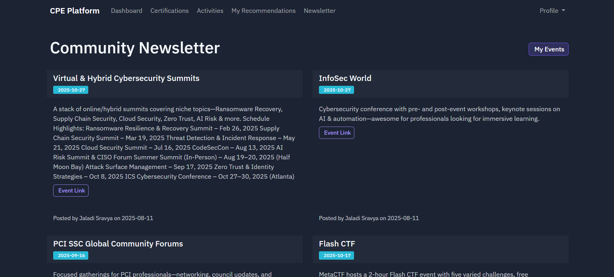

# CredPoint: Enterprise Certification Compliance Platform

A secure, centralized compliance platform for organizations to track, audit, and manage employee certifications and Continuing Professional Education (CPE) credits.

---

## Collaboration Note:
This is a collaborative project built by  Maddilavan Indraneeli Vardhan (https://github.com/Vardhan0257) and Jaladi Sravya (https://github.com/Sravya0605).  
Main repo: [https://github.com/Vardhan0257/cred-point](https://github.com/Vardhan0257/cred-point)

## Enterprise Capabilities

### 🛡️ Compliance & Audit
- **Audit-Ready Evidence:** Securely store and retrieve proof-of-completion documents using time-limited Signed URLs.
- **Automated Reporting:** Generate standardized PDF/CSV compliance reports for HR and external auditors.
- **Verification Workflows:** Track verification status of every CPE activity.

### 🚀 Team Management
- **Renewal Risk Dashboard:** Instantly identify employees at risk of certification lapse.
- **Centralized Tracking:** Unified view of CEH, (ISC)², and OffSec certifications across the organization.
- **Role-Based Access:** Secure separation between employee data and compliance oversight.

### ⚡ Automation
- **Smart Recommendations:** AI-driven suggestions for CPE activities based on certification type (e.g., OffSec Labs, White Papers).
- **Expiry Alerts:** Automated calculations for renewal deadlines and remaining credit requirements.

---

## Tech Stack

- **Core:** Python Flask (Enterprise Pattern)
- **Data & Auth:** Firebase Firestore & Authentication
- **Storage:** Google Cloud Storage (Signed URLs)
- **Reporting:** ReportLab (PDF Generation)
- **Security:** Environment-based config, RBAC-ready architecture

---

## Getting Started

### Prerequisites

- Python 3.8+
- Firebase account with Firestore and Authentication configured
- Flask installed (`pip install flask`)
- Firebase Admin SDK (`pip install firebase-admin`)

### Installation

1. Clone this repository:
   git clone https://github.com/<your-username>/CPECreditTracker.git
   cd CPECreditTracker

2. Create and activate a virtual environment
    python -m venv venv
    source venv/bin/activate
            or
    source venv\Scripts\activate (windows)

3. Install dependencies:
    pip install -r requirements.txt

4. Set up Firebase:
- Create a Firebase project
- Enable Firestore and Authentication as needed
- Download Firebase Admin SDK credentials JSON file and save it in the project directory (e.g., `firebase_credentials.json`)

5. Configure environment variables or update the app configuration:
    Ensure the app knows where to find the Firebase credentials:
    bash: export GOOGLE_APPLICATION_CREDENTIALS="firebase_credentials.json"
    Or update the path in firebase_config.py.

### Running the Application

1. Start the Flask server:
    bash: flask run or python app.py

2. Access the app at `http://localhost:5000`

---

## Usage

- Register/login (if authentication is implemented).
- Add and manage certifications with required CPE details.
- Submit cybersecurity events and upload proof documents.
- Track your progress towards certification renewal.
- Generate reports (CSV/PDF) for submission or record-keeping.
- Explore the newsletter page for upcoming non-CPE cybersecurity events.

---

## Screenshots

**Dashboard**  

**Certifications Page**  

**Add Certifications**  

**Recommendations**  

**Add Recommendations**  

**My Recommendations**  

**Add Activities**  

**Newsletter**  

---

## Contribution

Contributions and suggestions are welcome! Please read our Contribution Guidelines before submitting a pull request.

---

## License

This project is open source and available under the MIT License.

---

## Contact

For questions or collaboration inquiries, please reach out via vardhanm0257@gmail.com or jaladisravya7@gmail.com or visit the GitHub repository.

---

## Acknowledgments

- Inspired by the need to simplify CPE tracking for cybersecurity professionals.
- Thanks to the Firebase team.
